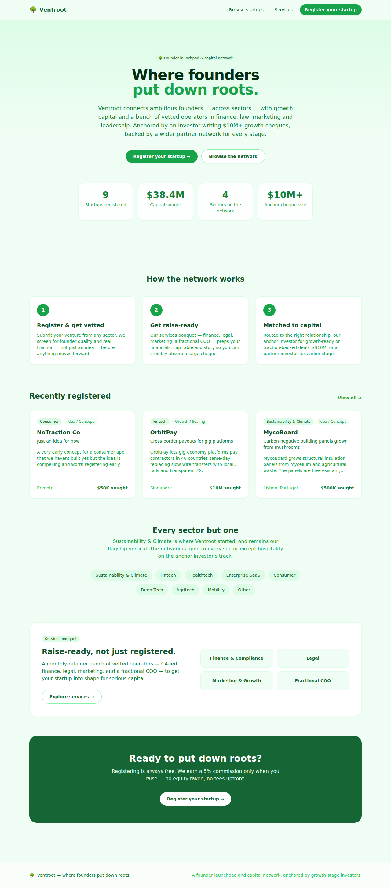

# 🌳 Ventroot — Founder Launchpad & Capital Network

Ventroot connects **ambitious founders — across sectors** — with growth
capital and a bench of vetted operators in finance, law, marketing and
leadership. Sustainability & Climate is the flagship vertical Ventroot
launched with; the network is sector-agnostic by design, anchored by an
investor writing $10M+ growth cheques and backed by a wider partner network
for earlier stages and other sectors.

Founders register free; we screen for founder quality and real traction,
get the company raise-ready through the services bouquet, then match it to
the right relationship in the capital network.



## Features

- **Landing page** with live network stats and the anchor-investor model
  front and center.
- **Startup registration form** with full server-side validation (name,
  tagline, sector, description, impact & edge, optional traction, stage,
  funding sought, location, website, founder contact).
- **Searchable registry** — filter by sector, stage, or keyword, across all
  sectors (hospitality excluded only on the anchor investor's track).
- **Startup detail pages** with the pitch, impact, traction (if provided),
  funding ask, and a "Contact founder" action.
- **Services page** — the monthly-retainer bouquet: Finance & Compliance
  (CA-led), Legal, Marketing & Growth, Fractional COO.
- **JSON REST API** (`/api/ideas`) backed by SQLite.
- Sensible **sample data** seeded automatically on first run, spanning
  sustainability, fintech and healthtech to reflect the broad network.

## Business model

- **Registering is always free.**
- **5% founder-paid commission** on capital successfully raised through
  Ventroot — charged only on close. Ventroot takes no equity of its own; an
  investor's equity stake in a company is separate from Ventroot's fee.
- **Services** (Finance & Compliance, Legal, Marketing & Growth, Fractional
  COO) are billed as a **monthly retainer**, independent of any raise.
- ⚠️ **Compliance:** a founder-paid, success-contingent commission on a
  capital raise is regulated intermediary activity in most jurisdictions
  (e.g. SEBI merchant-banker rules in India, broker-dealer rules in the US).
  Route the 5% fee through a licensed entity before it's charged on a real
  deal. Services retainers carry no such constraint.

See `docs/brand-guidelines.html` for the full brand and business-model
one-pager.

## Tech stack

| Layer     | Choice                                            |
| --------- | ------------------------------------------------- |
| Framework | Next.js 15 (App Router) + React 19 + TypeScript   |
| Styling   | Tailwind CSS                                       |
| Data      | SQLite via `better-sqlite3`                        |
| Validation| Zod                                                |
| Runtime   | Node.js 22, packaged as a standalone Docker image |

## Getting started (local)

```bash
npm install
npm run dev          # http://localhost:3000
```

Production build:

```bash
npm run build
npm run start
```

The SQLite database is created automatically under `./data/registry.db`
(override the directory with the `DATA_DIR` environment variable).

## API

| Method | Path              | Description                                   |
| ------ | ----------------- | --------------------------------------------- |
| `GET`  | `/api/ideas`      | List startups. Query: `sector`, `stage`, `q`. |
| `POST` | `/api/ideas`      | Register a startup (JSON body, validated).    |
| `GET`  | `/api/ideas/:id`  | Fetch a single startup.                       |

Example:

```bash
curl -X POST http://localhost:3000/api/ideas \
  -H 'Content-Type: application/json' \
  -d '{
    "startupName": "WindWeave",
    "tagline": "Community-owned micro wind turbines",
    "sector": "Sustainability & Climate",
    "description": "Small modular rooftop wind turbines that neighbourhoods co-own to generate clean local power.",
    "impact": "Each cluster offsets ~15 tonnes of CO2 a year.",
    "traction": "3 pilot installs live, 2 LOIs with municipal housing boards.",
    "stage": "Prototype",
    "fundingGoal": 600000,
    "location": "Copenhagen, Denmark",
    "founderName": "Freya Larsen",
    "founderEmail": "freya@example.com"
  }'
```

## Deployment

The app produces a **standalone** build and ships with a production
`Dockerfile`, so it runs anywhere that can run a container.

### Docker

```bash
docker build -t ventroot .
docker run -p 3000:3000 -v ventroot-data:/app/data ventroot
```

The named volume keeps the SQLite database across restarts.

### Render (one click)

A `render.yaml` blueprint is included with a persistent disk mounted at
`/var/data`. In the Render dashboard choose **New → Blueprint** and point it at
this repository.

### Other platforms

Any host that runs a Docker image or a Node.js standalone server works
(Fly.io, Railway, a VPS, etc.). Point `DATA_DIR` at a persistent volume so
registered startups survive redeploys. For a purely serverless host (e.g.
Vercel), swap the SQLite store in `src/lib/db.ts` for a hosted database — the
data-access layer in `src/lib/ideas.ts` is isolated for exactly this reason.

## Project structure

```
src/
  app/
    page.tsx              # Landing page
    register/             # Registration form (client) + page
    ideas/                # Registry list + [id] detail page
    services/             # Services bouquet page
    api/ideas/             # REST API routes
  components/             # Nav, Footer, IdeaCard
  lib/
    db.ts                 # SQLite connection + schema
    ideas.ts              # Data access + Zod validation
    constants.ts          # Sectors & stages (client-safe)
    seed.ts               # Sample data
    format.ts             # Currency/date helpers
docs/
  brand-guidelines.html   # Brand identity + business model one-pager
```
